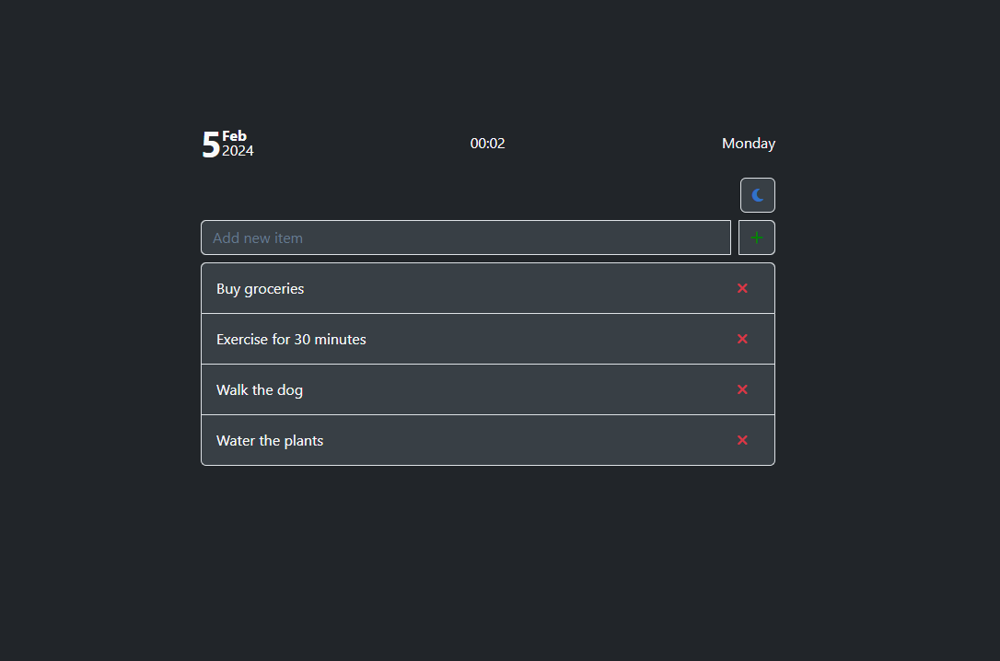

# To-Do List



This project is a simple To-Do List application where I explore Bootstrap and React. As part of my journey as a software engineer, I've used React's component-based architecture and Bootstrap's design elements to create a user-friendly task manager. 


## Features
- Add items to the list
- Remove items from the list
- Toggle between Dark and Light themes
- View current Date & Time
- Utilize local storage for data persistence

## Getting Started
1. **Clone the repository**:
   ```bash
   git clone https://github.com/finnleygrange/ToDoList.git
   ```
2. **Navigate to the project directory:**
   ```bash
    cd ToDoList/client
   ```
3. **Install dependencies:**
4. ```bash
    npm install
   ```
5. **Start the development server:**
   ```bash
    npm run dev
   ```
6. Once the server is running, open your web browser and go to **`http://localhost:3000`** to view the application.

## Contributing
If you would like to contribute to this To-Do List project please fork the repository and submit pull requests.
  
